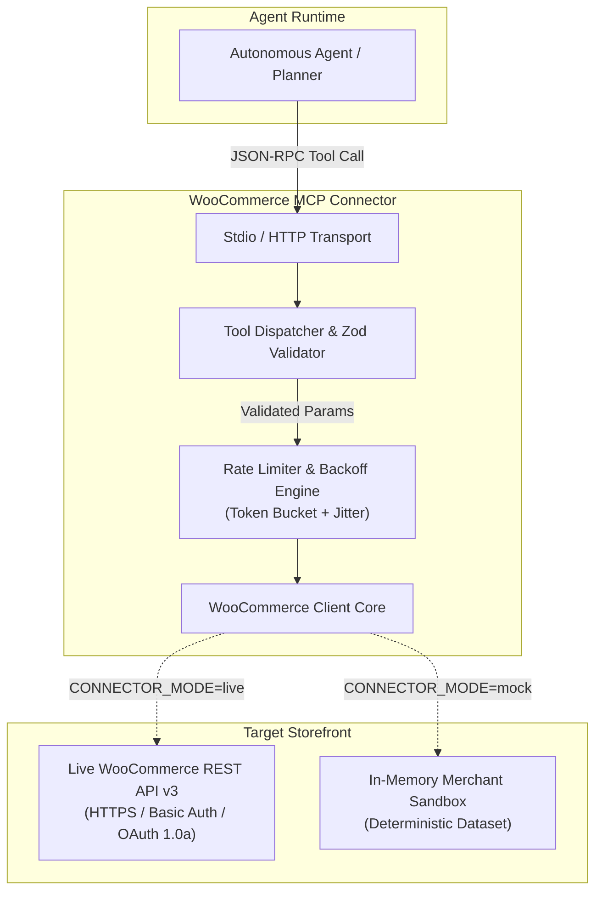

# Architecture & Technical Design

**Component:** WooCommerce Private Connector  
**Interface Standard:** Model Context Protocol (MCP)  
**Runtime:** Node.js (TypeScript ES2022)  

---

## 1. System Overview

The connector acts as a mediation layer between autonomous agent runtimes (such as Agent Studio, Claude Desktop, or Cursor) and merchant WooCommerce stores. It implements the Model Context Protocol (MCP) to decouple agent planning logic from store-specific schema details, rate limits, and network transports.

---

## 2. Authentication Flow

WooCommerce REST API v3 supports two authentication schemes depending on store TLS termination:

### Scheme A: HTTPS Basic Authentication (Standard)
When the merchant store runs over HTTPS:
- The connector passes the Consumer Key (`ck_...`) and Consumer Secret (`cs_...`) in the standard HTTP Basic Authentication header:
  `Authorization: Basic base64(consumer_key:consumer_secret)`
- All credentials remain encrypted in transit via TLS.

### Scheme B: OAuth 1.0a One-Legged HMAC-SHA256 (Non-SSL / Legacy)
When connecting over plain HTTP (local merchant staging or legacy environments):
- Basic Auth over HTTP would expose credentials in plaintext.
- The connector includes an internal OAuth 1.0a signature generator (`src/client/woocommerce.ts`):
  1. Gathers request parameters (`oauth_consumer_key`, `oauth_nonce`, `oauth_signature_method=HMAC-SHA256`, `oauth_timestamp`, `oauth_version=1.0`).
  2. Normalizes and URL-encodes parameters in lexicographical order.
  3. Forms the signature base string: `HTTP_METHOD & URL & PARAM_STRING`.
  4. Computes the HMAC-SHA256 digest using `consumer_secret &`.
  5. Appends `oauth_signature` to request query parameters.

---

## 3. Rate-Limiting & Throttling Resilience

Merchant stores frequently run on shared WordPress hosting or behind Cloudflare with strict rate limits. A production connector must prevent thundering herds and recover gracefully from upstream throttling.

### A. Token Bucket Algorithm
The connector shapes outbound request volume with a local token bucket:
- **Bucket Capacity:** Configurable (default: 60 tokens).
- **Refill Rate:** Smooth replenishment over time (`refillRate = RPM / 60000 tokens/ms`).
- Requests acquire a token before dispatch; if exhausted, requests await bucket replenishment rather than bursting upstream.

### B. Exponential Backoff with Full Randomized Jitter
When an upstream server returns `HTTP 429 Too Many Requests` or `HTTP 5xx Server Error`:
1. **Header Parsing**: The connector checks the `Retry-After` header (handling both integer seconds and HTTP dates).
2. **Backoff Calculation**: If no header is present, backoff with randomized jitter is computed:
   `delay = Math.min(maxBackoff, baseBackoff * Math.pow(2, attempt) + jitter)`
   where `jitter = Math.random() * (0.5 * baseBackoff)`.
3. **Thundering Herd Mitigation**: Randomized jitter prevents concurrent agent instances from synchronizing their retries.
4. **Retry Budget**: Capped at `maxRetries` (default: 4 attempts). Client errors (`401 Unauthorized`, `403 Forbidden`, `404 Not Found`) fail fast without retrying.

---

## 4. Dual-Mode Architecture (Mock Sandbox vs Live Store)

To support local development, integration testing, and CI/CD pipelines without requiring credentials to an external WordPress instance:
- **`CONNECTOR_MODE=mock` (Default)**:
  - Requires zero API keys or external network dependencies.
  - Boots with an in-memory dataset of 6 realistic merchant orders in INR, featuring Razorpay payment IDs (`pay_...`), varied statuses (`processing`, `completed`, `refunded`, `failed`), and multi-item baskets.
  - Includes a simulation utility to verify HTTP 429 backoff handling.
- **`CONNECTOR_MODE=live`**:
  - Connects to any live WooCommerce store running WooCommerce 3.5+.
  - Fully implements the WooCommerce REST API v3 `/orders` endpoints.

---

## 5. Payment Reconciliation Primitive

Support and finance agents frequently need to investigate customer claims like:
> *"Customer says payment pay_P1A98765432101 was deducted, but the order is still pending. Can you verify?"*

The connector exposes `reconcile_payment` to handle this in a single atomic tool call:
1. Retrieves order details by `order_id`.
2. Verifies whether `transaction_id` or `_razorpay_payment_id` metadata matches.
3. Performs floating-point safe amount verification against `expected_amount`.
4. Inspects WooCommerce order status against payment state.
5. Returns a structured verdict (`matched: true | false`, `notes: []`, `discrepancies: []`).
